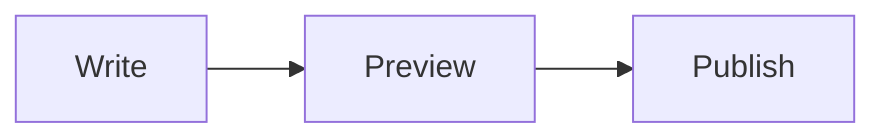

## Welcome to Tyndall

Tyndall is a modern Astro blog theme focused on details and visual experience.

### Key Features

- 🎨 **Beautiful Design** - Delicate visual effects and smooth animations
- 🌓 **Dark Mode** - Support for light/dark theme switching
- 🌍 **Internationalization** - Built-in Chinese and English support
- 📱 **Responsive** - Perfect adaptation for all devices
- ⚡ **High Performance** - Built on Astro, blazing fast
- 🎵 **Music in your posts** - Embed Apple Music songs, albums and playlists with one directive
- 🗺️ **Travel maps** - Mark places in a travel post and switch between days
- 📝 **Quick notes** - Publish a Memo by messaging your Telegram Bot
- 🟢 **Live status** - Share your current activity and playing music with Nowcast

### Getting Started

1. Clone the project
2. Install dependencies: `pnpm install`
3. Start dev server: `pnpm dev`
4. Start creating your content!

See the [configuration guide](/en/blog/config) for site settings, deployment and integrations. First, try a few of Tyndall's own writing features.

## 🎵 Put Music Between Your Paragraphs

When writing about an album, you can include its player instead of just a link. In Apple Music, choose **Share → Copy Link**, then add a directive on its own line:

```markdown
A little music to go with today's walk.

::apple-music{url="https://music.apple.com/us/album/how-to-be-a-human-being/1440840097"}

Then carry on with the story.
```

Here is the result:

::apple-music{url="https://music.apple.com/us/album/how-to-be-a-human-being/1440840097"}

Share links for songs, albums and public playlists work here. Keep the `?i=trackID` part of a song link, or it may open the whole album. Songs default to 175px high, albums and playlists to 450px. Add `height="300"` to choose your own height.

This is a **block directive**: give it its own line, with blank lines before and after. No iframe markup or Apple API key is needed. Apple provides the player; playback may depend on region, sign-in and content availability. The theme does not download audio to your site.

## 🗺️ Add a Map to Your Travel Story

Put your stops in the article's frontmatter, then place the map directive in the body. Here is a fictional walk through Paris:

```yaml
map:
  days:
    - day: 1
      color: '#a259ec'
      stops:
        - name: Eiffel Tower
          coords: [2.2945, 48.8584]
          note: Start the day's walk here
        - name: Louvre Museum
          coords: [2.3376, 48.8606]
```

Merge `map:` into the existing `---` frontmatter, alongside `title` and `pubDate`. Then add this on its own line in the body:

```markdown
::travel-map{height="480"}
```

That is how this map was created. Pan, zoom and click the places to explore:

::travel-map{height="480"}

Coordinates use **[longitude, latitude]**. Put `stops` in visit order. The default straight lines show that order, not walking directions. Add `day: 2`, `day: 3` and so on for more days, each with its own color.

The map uses article data, not photo EXIF, and does not require a `/travel` gallery. Loading the basemap needs an internet connection. For road routes and custom basemaps, see the [configuration guide](/en/blog/config). Check that your locations are suitable for sharing before publishing.

## 📝 Quick Notes Without Opening an Editor

Once your Telegram Bot is configured, send “Finished a good book today #reading” or a photo album with a caption to publish a Memo. The blog reads new posts from Supabase, so each note does not require a redeploy.

The [configuration guide](/en/blog/config) covers the Bot, commands and photo storage. Feishu and Discord can support the same flow with additional development; their receivers are not currently included.

## 🟢 Share What You Are Doing Now

Nowcast can send your current activity and background Apple Music information to the blog's status card, such as “Writing with Obsidian.” This status expires: it does not create articles or Memos, or change your album wall.

After installing the client, configure the receiver endpoint and write secret using the [configuration guide](/en/blog/config). Choose the activity descriptions you want to make public before sharing.

## 🔧 Bring Your Everyday Tools into Lab

Lab can show writing rhythm, recent bookmarks, server metrics and self-hosted services. These are snapshots, not live requests from visitors' browsers: writing rhythm comes from Git history, while Karakeep and Beszel provide bookmark and server data. GitHub Actions can save the snapshots and request a site rebuild.

The public theme starts with sample data. Connect only what you need, or maintain the files manually. See the [configuration guide](/en/blog/config) for variables, workflows and what becomes public.

## ✍️ A Few Small Writing Helpers

Alongside standard Markdown, you can write keyboard shortcuts, highlights and collapsible notes:

```markdown
Press :kbd[Ctrl] + :kbd[S] to save, or :mark[highlight] a key point.

:::details[Read more]
Keep writing Markdown here, including formulas such as $E=mc^2$.
:::
```

Press :kbd[Ctrl] + :kbd[S] to save, or :mark[highlight] a key point.

:::details[Read more]
Keep writing **Markdown** here, including formulas such as $E=mc^2$.
:::

Mermaid diagrams work in fenced code blocks too:

````markdown

````


## Comprehensive Markdown Rendering Test

This is an article designed to test the capabilities of a Markdown rendering engine. It includes a variety of Markdown elements to ensure your website can display all formats correctly and beautifully.

#### Headings

Here are all levels of headings, from one to six:

# Heading 1

## Heading 2

### Heading 3

#### Heading 4

##### Heading 5

###### Heading 6

-----

#### Text Styles

Here are some basic text formatting styles:

  * **Bold Text** (**Bold**)
  * *Italic Text* (*Italic*)
  * ***Bold & Italic Text*** (***Bold & Italic***)
  * ~~Strikethrough~~ (~~Strikethrough~~)
  * This is an example of `inline code`, like `const greeting = "Hello, World!";`.
  * \<u\>Underlined Text (achieved via HTML tag)\</u\>
  * Keyboard style: \<kbd\>Ctrl\</kbd\> + \<kbd\>C\</kbd\>

-----

#### Blockquotes

> This is a standard blockquote. It's often used for quoting someone or highlighting a specific passage of text.
>
> > This is a nested blockquote, which can be used to represent a quote within a quote.
>
> — Anonymous

-----

#### Lists

##### Unordered List

  * List Item A
  * List Item B
      * Nested List Item B1
      * Nested List Item B2
  * List Item C

##### Ordered List

1.  First step: Prepare the materials
2.  Second step: Start coding
    1.  Write the HTML structure
    2.  Add CSS for styling
    3.  Implement the JavaScript logic
3.  Third step: Deploy to production

##### Task Lists

  - [x] Complete the design mockup
  - [x] Write the front-end code
  - [ ] Connect to the back-end API
  - [ ] Write test cases

-----

#### Code Blocks

Code blocks are essential for technical blogs. Below is a JavaScript code sample with syntax highlighting:

```javascript
// A simple function to greet a user
function greet(user) {
  if (user) {
    console.log(`Hello, ${user.name}! Welcome to our site.`);
  } else {
    console.log('Hello, guest!');
  }
}

const myUser = {
  name: "Alex",
  age: 28
};

greet(myUser);
```

-----

#### Tables

Table alignment also needs to be tested.

| Left-Aligned | Center-Aligned | Right-Aligned |
| :--- | :---: | ---: |
| Apple | 🍎 | $1.00 |
| Banana | 🍌 | $0.50 |
| Orange | 🍊 | $0.80 |

-----

#### Links & Images

This is a link to [Google](https://www.google.com "Tooltip Title").

And here is an image (using a placeholder service):

-----

#### Horizontal Rule

A horizontal rule was used to separate each section above. It can be created using `---`, `***`, or `___`.

-----
End of test. If all the elements above are displayed correctly, your Markdown rendering configuration is perfect\!
