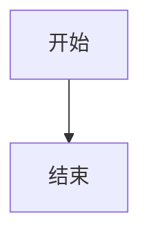

## 欢迎使用 Tyndall

Tyndall 是一个现代化、注重细节与视觉体验的 Astro 个人博客主题。

### 主要特性

- 🎨 **精美设计** - 细腻的视觉效果和流畅的动画
- 🌓 **深色模式** - 支持亮色/暗色主题切换
- 🌍 **国际化** - 内置中英文双语支持
- 📱 **响应式** - 完美适配各种设备
- ⚡ **高性能** - 基于 Astro 构建，速度超快

### 开始使用

1. 克隆项目
2. 安装依赖：`pnpm install`
3. 启动开发服务器：`pnpm dev`
4. 开始创作你的内容！

### Markdown 渲染测试

#### 标题 (Headings)

以下是所有级别的标题，从一级到六级：

# 标题一 H1

## 标题二 H2

### 标题三 H3

#### 标题四 H4

##### 标题五 H5

###### 标题六 H6

-----

#### 文本样式 (Text Styles)

这里是一些基本的文本格式：

  * **加粗文本** (**Bold**)
  * *斜体文本* (*Italic*)
  * ***加粗并斜体*** (***Bold & Italic***)
  * ~~删除线~~ (~~Strikethrough~~)
  * 这是一个行内代码 `const greeting = "Hello, World!";` 的例子。
  * <u>下划线 (通过 HTML 标签实现)</u>
  * 按键样式： <kbd>Ctrl</kbd> + <kbd>C</kbd>

-----

#### 引用块 (Blockquotes)

> 这是一个标准的引用块。它通常用于引用他人的话语或突出显示某段文字。
>
> > 这是一个嵌套的引用块，可以用来表示引用中的引用。
>
> — 佚名

-----

#### 列表 (Lists)

##### 无序列表

  * 列表项 A
  * 列表项 B
      * 嵌套列表项 B1
      * 嵌套列表项 B2
  * 列表项 C

##### 有序列表

1.  第一步：准备材料
2.  第二步：编码
    1.  编写 HTML 结构
    2.  添加 CSS 样式
    3.  实现 JavaScript 逻辑
3.  第三步：部署上线

##### 任务列表 (Task Lists)

  - [x] 完成设计稿
  - [x] 编写前端代码
  - [ ] 连接后端 API
  - [ ] 撰写测试用例

-----

#### 代码块 (Code Blocks)

代码块是技术博客中必不可少的部分。下面是一个带有语法高亮的 JavaScript 代码示例：

```javascript
// A simple function to greet a user
function greet(user) {
  if (user) {
    console.log(`Hello, ${user.name}! Welcome to our site.`);
  } else {
    console.log('Hello, guest!');
  }
}

const myUser = {
  name: "Alex",
  age: 28
};

greet(myUser);
```

-----

#### 表格 (Tables)

表格的对齐方式也需要测试。

| 左对齐 | 居中对齐 | 右对齐 |
|:-------|:--------:|-------:|
| Apple  | 🍎       | ¥10    |
| Banana | 🍌       | ¥5     |
| Orange | 🍊       | ¥8     |
| 长文本测试项 | 中等文本 | 短 |

**复杂表格示例：**

| 功能 | 描述 | 状态 | 优先级 |
|:-----|:-----|:----:|-------:|
| 用户登录 | 实现用户认证系统 | ✅ 完成 | 高 |
| 数据导出 | 支持 CSV/Excel 导出 | 🚧 进行中 | 中 |
| 邮件通知 | 自动发送提醒邮件 | ⏰ 待开始 | 低 |

-----

#### 链接与图片 (Links & Images)

这是一个指向 [Google](https://www.google.com "悬停标题") 的链接。

下面是一张图片 (使用占位图服务)：

-----

#### 水平分割线 (Horizontal Rule)

上面的每个部分都使用了水平分割线来进行分隔。可以通过 `---`, `***`, 或 `___` 来创建。

-----

## 表格对齐测试

这是一个专门测试表格对齐的示例：

| 商品名称（左对齐） | 数量（居中） | 单价（右对齐） |
|:------------------|:------------:|--------------:|
| 苹果              | 10个         | ¥3.50         |
| 香蕉              | 5根          | ¥2.00         |
| 橙子              | 8个          | ¥4.20         |
| **总计**          |              | **¥95.40**    |

## HTML 标签测试

### 文本装饰效果

- <u>下划线文本</u>（使用 `<u>` 标签）
- <mark>高亮文本</mark>（使用 `<mark>` 标签）
- <del>删除文本</del>（使用 `<del>` 标签）
- <ins>插入文本</ins>（使用 `<ins>` 标签）
- <small>小号文本</small>（使用 `<small>` 标签）

### 上标和下标

- 化学公式：H<sub>2</sub>O（水）、CO<sub>2</sub>（二氧化碳）
- 数学公式：X<sup>2</sup> + Y<sup>2</sup> = Z<sup>2</sup>
- 脚注引用：这是一段文本<sup>[1]</sup>

### 按键样式

使用 `<kbd>` 标签显示键盘按键：

- 复制：<kbd>Ctrl</kbd> + <kbd>C</kbd>
- 粘贴：<kbd>Ctrl</kbd> + <kbd>V</kbd>
- 保存：<kbd>Ctrl</kbd> + <kbd>S</kbd>
- 撤销：<kbd>Ctrl</kbd> + <kbd>Z</kbd>
- Mac 用户：<kbd>⌘ Cmd</kbd>  +  <kbd>C</kbd>

### 缩写说明

悬停在缩写上查看完整说明：

- <abbr title="HyperText Markup Language">HTML</abbr>
- <abbr title="Cascading Style Sheets">CSS</abbr>
- <abbr title="JavaScript">JS</abbr>

## 任务列表

- [x] 已完成的任务
- [ ] 未完成的任务

## 定义列表

定义列表需要使用 HTML 标签（标准 Markdown 不支持）：

<dl>
  <dt>Markdown</dt>
  <dd>一种轻量级标记语言</dd>
  
  <dt>HTML</dt>
  <dd>超文本标记语言</dd>
  
  <dt>CSS</dt>
  <dd>层叠样式表，用于网页样式设计</dd>
</dl>

## 折叠面板

使用 HTML5 的 `<details>` 和 `<summary>` 标签创建可折叠内容：

<details>
<summary>📖 点击展开查看更多信息</summary>

这里是折叠的内容。可以包含：

- 列表项
- **加粗文本**
- `代码片段`

```javascript
console.log("甚至可以包含代码块！");
```

</details>

<details>
<summary>💡 常见问题解答</summary>

**Q: 如何使用这个功能？**

A: 只需点击标题即可展开或收起内容。

**Q: 可以嵌套使用吗？**

A: 可以的！

<details>
<summary>嵌套的折叠面板</summary>

这是嵌套在内部的内容。

</details>

</details>

### mermaid 图表


爱因斯坦质能方程 $E = mc^2$

$$
\int_{a}^{b} f(x) \, dx = F(b) - F(a)
$$

测试结束。如果以上所有元素都显示正常，那么你的 Markdown 渲染配置就是完美的！